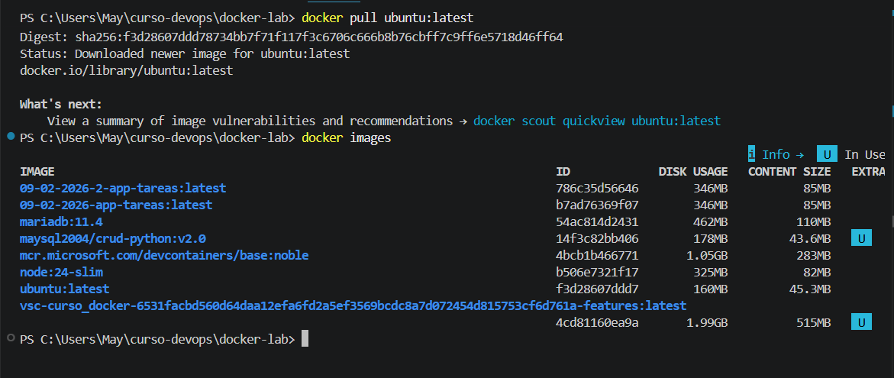
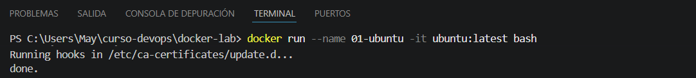
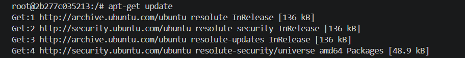
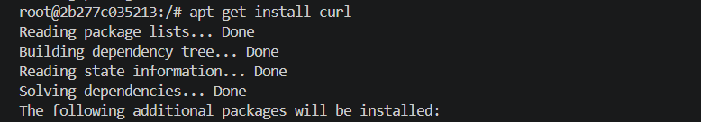
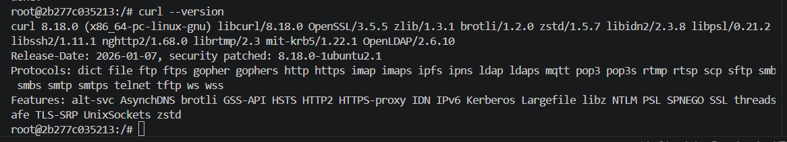
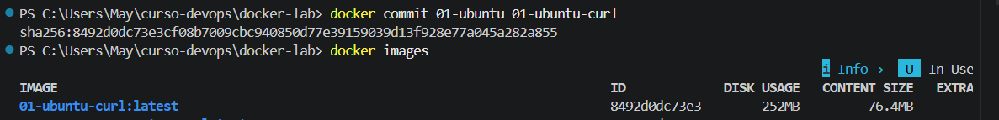

# docker-lab
Curso CEP: Introducción a DevOps. Laboratorio Docker

## Ejercicio 1. Creando imágenes

**Paso 1 (Sin Dockerfile)**

Con docker run podría descargar y ejecutar la imagen ubuntu a la vez,pero prefiero hacerlo por pasos y así recordar las órdenes cli de docker. Por ello, realizo docker pull y luego, docker images, así compruebo que se ha descargado bien.

Ahora ejecuto la orden docker run, con --name puedo darle un nombre a mi contenedor y con -it son los flags para abrir el terminal y poder interactuar con el S.O. Ubuntu.
El orden de los flags no es importante,lo importante es que el nombre de la imagen Ubuntu y bash sea el último, el comando a ejecutar siempre se pone al final.

Si queremos acceder a la terminal de un contenedor que ya está ejecutandose, no tenemos que usar docker run -it otra vez para acceder, con usar el comando docker exec -it nombre_contenedor bash sería suficiente.

Observamos que el prompt ha cambiado, estamos dentro del contenedor y los comandos que escribamos ahora se ejecutarán en él, y no en mi ordenador.

*Actualización del Sistema*

*Instalación de curl*

*Comprobación de curl con su versión*

*Pregunta: ¿Con qué comando podrías guardar los cambios del contenedor como una nueva imagen?*

Los cambios del contenedor los podemos guardar con el comando docker commit. Usamos el comando para crear una nueva imagen a partir de los cambios que hayamos hecho en el contenedor.

*docker commit*

**Paso 2 (Con Dockerfile)**