# docker-lab
Curso CEP: Introducción a DevOps. Laboratorio Docker

## Ejercicio 1. Creando imágenes (Obligatorio)

**Paso 1 (Sin Dockerfile)**

Con docker run podría descargar y ejecutar la imagen ubuntu a la vez,pero prefiero hacerlo por pasos y así recordar las órdenes cli de docker. Por ello, realizo docker pull y luego, docker images, así compruebo que se ha descargado bien.

Ahora ejecuto la orden docker run, con --name puedo darle un nombre a mi contenedor y con -it son los flags para abrir el terminal y poder interactuar con el S.O. Ubuntu.
El orden de los flags no es importante,lo importante es que el nombre de la imagen Ubuntu y bash sea el último, el comando a ejecutar siempre se pone al final.

Si queremos acceder a la terminal de un contenedor que ya está ejecutandose, no tenemos que usar docker run -it otra vez para acceder, con usar el comando docker exec -it nombre_contenedor bash sería suficiente.

Observamos que el prompt ha cambiado, estamos dentro del contenedor y los comandos que escribamos ahora se ejecutarán en él, y no en mi ordenador.

*Actualización del Sistema*

*Instalación de curl*

*Comprobación de curl con su versión*

*Pregunta: ¿Con qué comando podrías guardar los cambios del contenedor como una nueva imagen?*

Los cambios del contenedor los podemos guardar con el comando docker commit. Usamos el comando para crear una nueva imagen a partir de los cambios que hayamos hecho en el contenedor.

*docker commit*

**Paso 2 (Con Dockerfile)**

Creamos la imagen con Dockerfile, es un archivo sin extensión y con la D en mayúsculas.

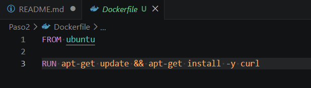

Se recomienda que se cree en la misma carpeta de donde se vaya a hacer docker built, es importante poner el **.** al final de la orden

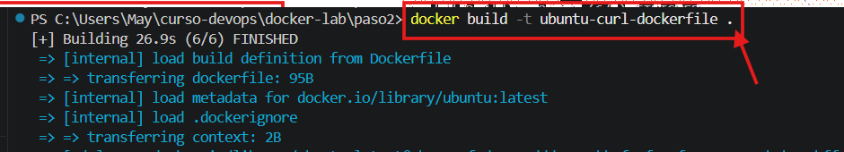

Comprobamos que la imagen se ha creado con docker images

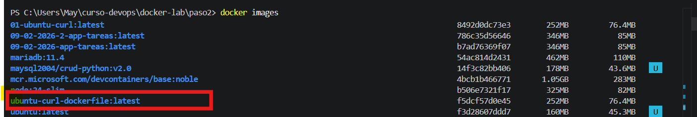

Para usar la nueva imagen en el contenedor y para comprobar que curl está instalado, podemos tener un par de opciones:

- Usar docker run con el flag -it y, al final, orden bash para entrar a la terminal e interactuar y, a continuación hacer curl --version

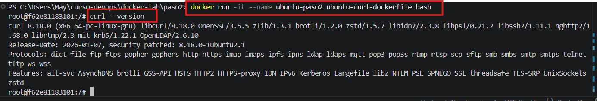
- Usar docker run sin flag -it y, al final, poner la orden curl --version

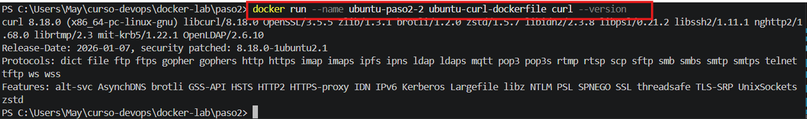

*Pregunta: ¿Qué comando permite ver las capas de una imagen Docker?*

Con el comando docker history nombre_imagen

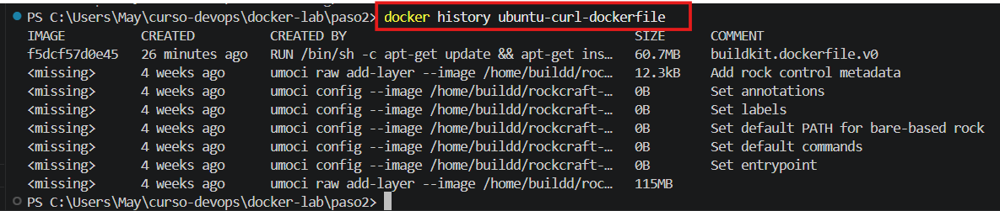

## Ejercicio 3. Volúmenes persistentes (Obligatorio)

**Paso 1: Creación, modificación e inserción de datos**

Creamos y ejecutamos un contenedor de postgres con un volumen docker montado en /var/lib/postgresql/data

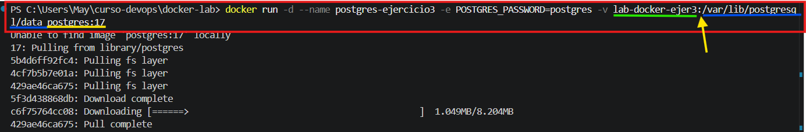

Comprobamos que se ha creado dicho contenedor:

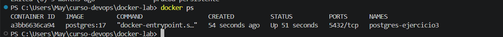

Creamos la tabla items en la base de datos e insertamos un dato:

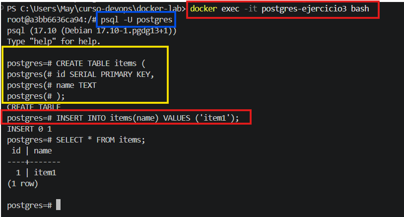

**Paso 2: Comprobamos con parada y borrado del contenedor y, creamos un nuevo contenedor usando el mismo volumen**

Vamos a comprobar que los datos son persistentes aunque se elimine el contenedor:
- Eliminamos el contenedor, con flag -f para forzar el borrado, ya que no se puede eliminar un contenedor en up

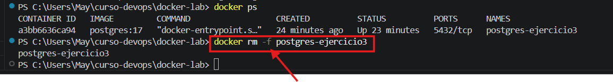

- Creamos un nuevo contenedor con el mismo volumen

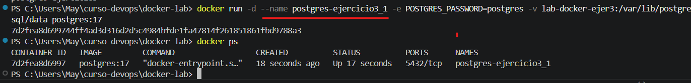

- Vamos a la terminal, una vez dentro comprobamos que el item existe haciendo SELECT

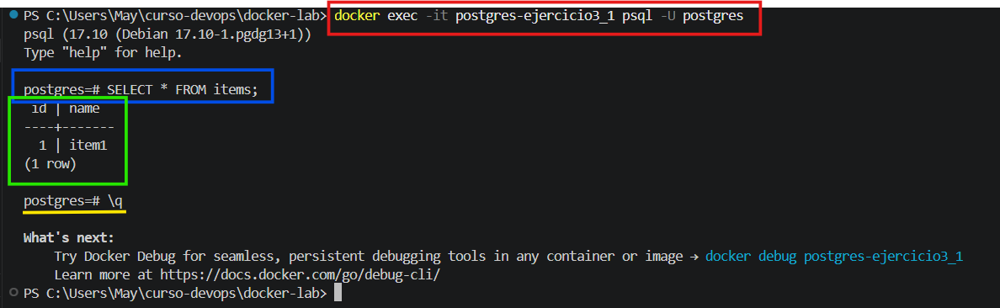

## Ejercicio 4. Bind Mounts (Obligatorio)

Queremos probar a enlazar un archivo de nuestro equipo con uno de un contenedor.
- Creamos un directorio llamado web y ahí creamos el archivo index.html con el siguiente contenido (todo en mi equipo)

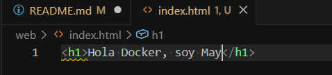

- Creamos un contenedor nginx, mapeando el puerto 80 y enlazo el archivo index.html de mi carpeta web con /usr/share/nginx/html/index.html

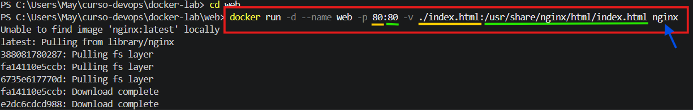

- Abrimos el navegador y como lo hemos mapeado 80:80, no es necesario ponerle otro puerto en localhost, por lo que directamente muestra el index.html

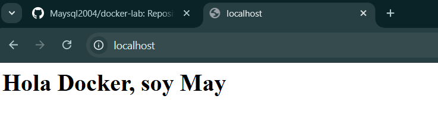

*Pregunta: ¿Qué ocurre si modificas el archivo index.html en tu máquina?**

Que los Bind mounts son más flexibles que la persistencia en los volúmenes, no ha sido necesario eliminar el contenedor para comprobar que el contenido sigue como ocurría con los volúmenes, aquí con el mapeo de los puertos, cualquier modificación que hagamos en nuestro equipo ya se ve reflejado en la página http://localhost, ya que el servicio web del contenedor lee directamente de ese archivo. Es genial, me encantaaa!!

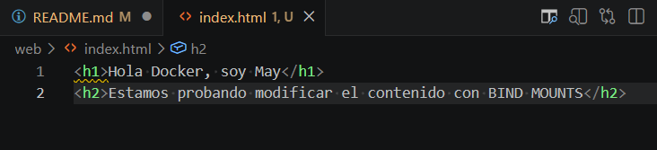

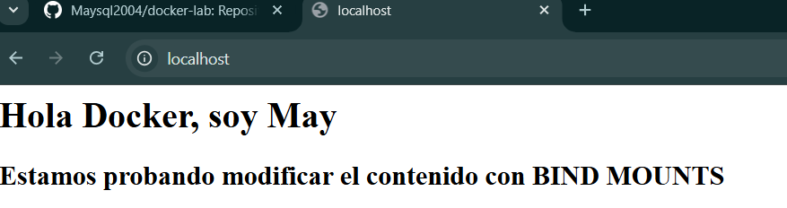

## Ejercicio 6. Creando redes privadas (Obligatorio)

**Creamos una red llamada my-net**

Hasta ahora hemos estado trabajando con la red por defecto de Docker y, ahora vamos a crear una red privada para que se entiendan nuestros contenedores. No tendremos que preocuparnos por el servicio DNS ya que Docker lo habilitará por defecto y a nivel interno, con lo que los contenedores podrán comunicarse por su nombre. Por otro lado, mis contenedores estarán aislados del resto.

- Creamos la red my-net:

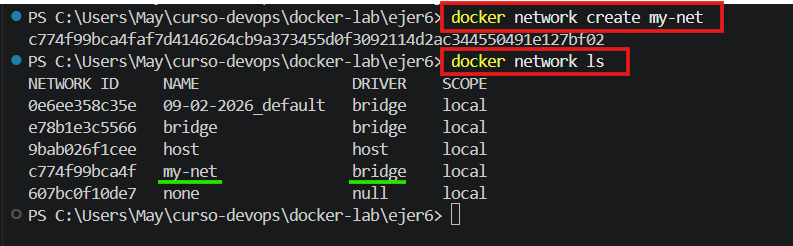

- Arrancamos dos contenedores ubuntu en esa red. He probado a usar el flag -d para que los contenedores se mantuvieran en up, pero no era posible con lo que haciendo uso de sleep infinity al final, es cuando puedo mantener el contenedor en ejecución. Al no tener esa imagen ninún servicio corriendo, una vez que el contenedor se crea se para. El comando sleep los mantiene en ejecución para que pueda interactuar con ellos.

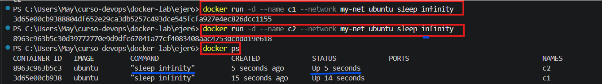

- Ejecuto un contenedor con el flag -it y bash para probar si la herramienta ping está instalada, como me da fallo, hago la actualización de Ubuntu y la instalación de la herramienta iputils-ping

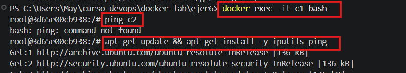

- Haciendo ping a c2

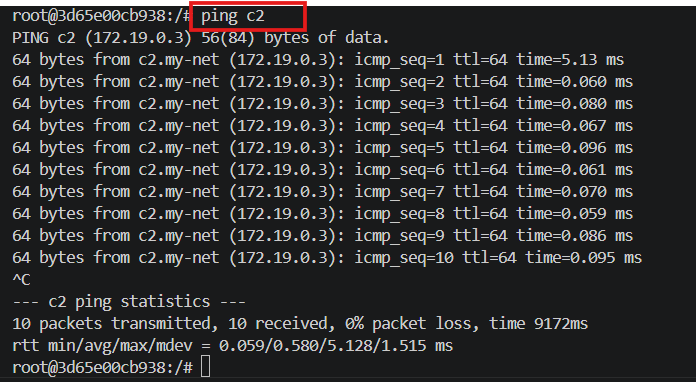

**Pregunta: ¿Los contenedores pueden comunicarse entre sí?**

Ya hemos podido comprobar a través de la herramienta ping que SÍ.

## Ejercicio 9. Docker Compose --- Compartiendo volúmenes (Obligatorio)

**Creamos el fichero docker-compose.yml con dos servicios**

- Docker Compose con dos contenedores que comparten el volumen /app/logs. Uno escribe en él y el otro lee. El primer docker compose que hice me dio error ocurre por una carrera de velocidad (race condition) entre los dos contenedores, ya que el contenedor reader arranca más rápido e intenta leer el archivo log.txt antes de que el contenedor writer tenga tiempo de crearlo.

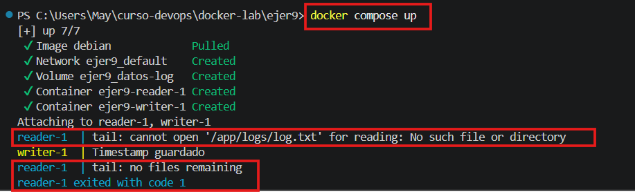

- Como el archivo no existe en ese milisegundo inicial, tail falla y el contenedor se apaga.

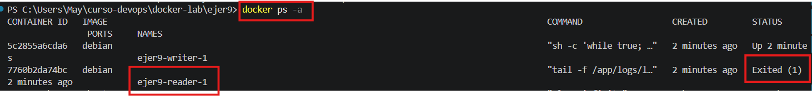

- Modificación de docker-compose.yml, en el comando del reader para que espere a que el archivo exista antes de intentar leerlo, y le hemos añadido depends_on para que respete el orden lógico de arranque.

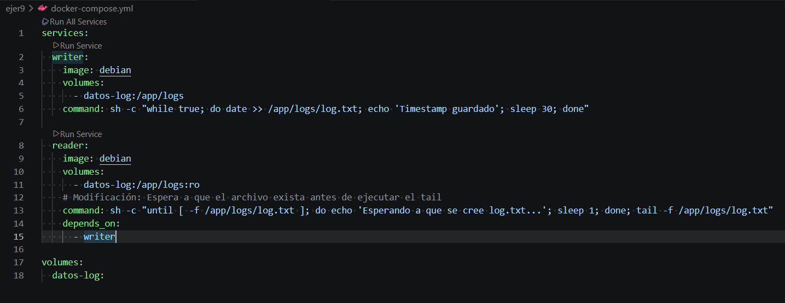

- Para aplicar los cambios, primero tenemos que apagar lo que esté corriendo actualmente con docker compose down

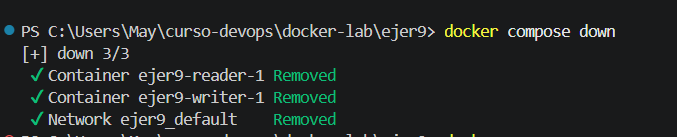

Segundo hacer nuevamente docker compose up

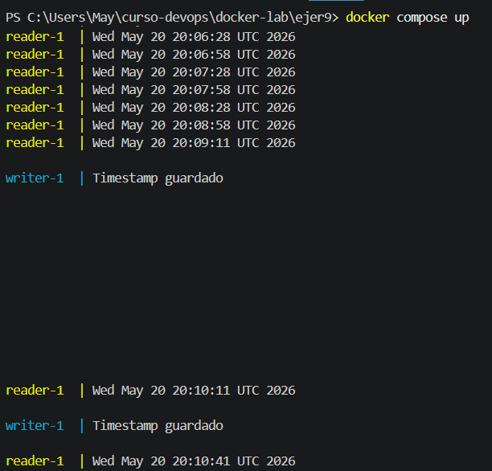

También podemos hacer docker compose up con el flag -d para que se ejecute en segundo plano

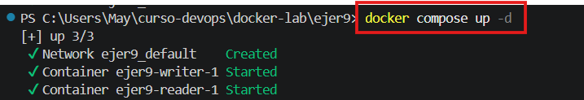

Y, para ver la ejecución lo haríamos con docker compose logs con el flag -f para filtrarlo por el nombre del contenedor requerido

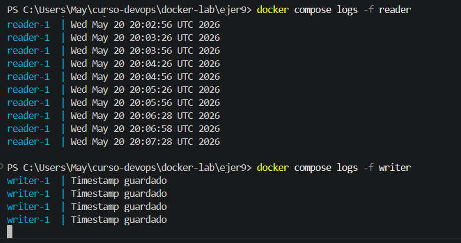

**Y, ésto sería todo sobre la parte de ejercicios obligatorios del curso.**

**Muchas gracias por el aprendizaje!!**

